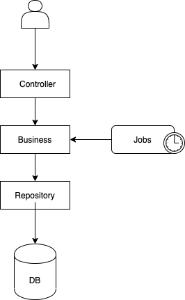

## Wenance Calc
Esta es una app challenge para el ingreso a Wenance.

### Detalles de la implementación
La elección de esta arquitectura se debe que, al no ser un proyecto tan grande puede 
hacerse de esta manera, separando por capas definidas que tengan componentes con sus 
responsabilidades.
La arquitectura del proyecto es una arquitectura que consta de 3 capas principales:
* Controller: Esta capa es la encargada de la presentación de los datos, además de ser 
la encargada de manejar los request. Aquí es donde se definen los endpoints.
* Business: La capa donde sucede lo más importante. Donde se centra la parte del negocio 
y se hacen los calculos, recolección y persistencia de datos, etc.
* Repository: Capa de persistencia de datos. Se opto por tener un repositorio debido a que 
Es más simple de manejar y de implementar para lo que nosotros necesitamos (Consulta y 
escritura de datos).

Además se agrega una capa ``jobs`` -más bien un paquete- que sería quien ejecute la tarea para 
recolectar los datos cada 10 segundos. Y un páquete `utils` para que útilidades. 



#### Tecnologias

* Spring Boot Web 
* Spring Boot JPA
* H2 Database

### Ejecución de la app
La aplicación se puede levantar de forma local mediante 2 formas:

* Mediante la ejecución de la función main en el archivo
```
WenanceChallengeApplication.java
  ```

* Mediante la linea de comandos con el plugin de springboot para gradle:

```
./gradlew bootRun
```

### Request ejemplo:
#### Buscar precio en una fecha
En request ejemplo para buscar precio en una fecha corresponde 
al endpoint ``/find-one`` y solo se debe envíar un body con los campos
date que significa la fecha y el pattern para interpretar esa fecha:
```shell script
curl --location --request GET 'localhost:8080/find-one' \
--header 'Content-Type: application/json' \
--data-raw '{
    "date": "2020-10-14 18:02:34.563",
    "pattern": "yyyy-MM-dd HH:mm:ss.SSS"
}'
```
Y la respuesta es la siguiente:
````json
{
    "date": "2020-10-18T20:33:37.933+00:00",
    "price": 11459.20
}
````

#### Buscar en detalle
El request ejemplo para buscar entre dos fechas los detalles de:
* Precio máximo
* Promedio de precio
* Diferencia porcentual
Es el siguiente:

````shell script
curl --location --request GET 'localhost:8080/find-detail' \
--header 'Content-Type: application/json' \
--data-raw '{
    "dateFrom": "2020-10-18 17:25:59.606",
    "dateTo": "2020-10-18 17:35:53.561",
    "pattern": "yyyy-MM-dd HH:mm:ss.SSS"
}'
````
Y la respuesta es:
````json
{
    "avgPrice": 11451.11,
    "maxPrice": 11453.20,
    "differencePercentage": 0.02
}
````